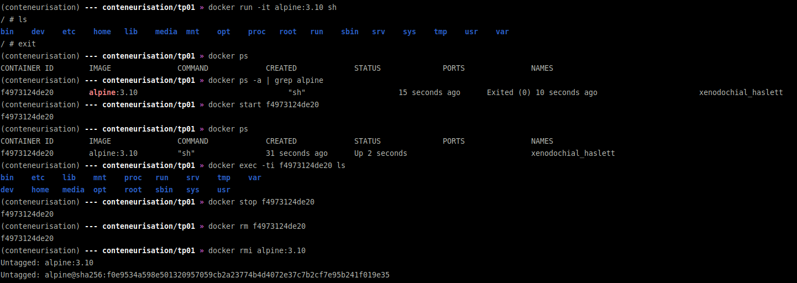

# Conteneurisation M2 TP01

## Initiation à la cli

* commandes
```bash
(conteneurisation) --- conteneurisation/tp01 » docker run -it alpine:3.10 sh 
/ # ls
bin    dev    etc    home   lib    media  mnt    opt    proc   root   run    sbin   srv    sys    tmp    usr    var
/ # exit
(conteneurisation) --- conteneurisation/tp01 » docker ps                    
CONTAINER ID        IMAGE               COMMAND             CREATED             STATUS              PORTS               NAMES
(conteneurisation) --- conteneurisation/tp01 » docker ps -a | grep alpine
f4973124de20        alpine:3.10                                  "sh"                     15 seconds ago      Exited (0) 10 seconds ago                       xenodochial_haslett
(conteneurisation) --- conteneurisation/tp01 » docker start f4973124de20
f4973124de20
(conteneurisation) --- conteneurisation/tp01 » docker ps
CONTAINER ID        IMAGE               COMMAND             CREATED             STATUS              PORTS               NAMES
f4973124de20        alpine:3.10         "sh"                31 seconds ago      Up 2 seconds                            xenodochial_haslett
(conteneurisation) --- conteneurisation/tp01 » docker exec -ti f4973124de20 ls
bin    etc    lib    mnt    proc   run    srv    tmp    var
dev    home   media  opt    root   sbin   sys    usr
(conteneurisation) --- conteneurisation/tp01 » docker stop f4973124de20
f4973124de20
(conteneurisation) --- conteneurisation/tp01 » docker rm f4973124de20
f4973124de20
(conteneurisation) --- conteneurisation/tp01 » docker rmi alpine:3.10
Untagged: alpine:3.10
Untagged: alpine@sha256:f0e9534a598e501320957059cb2a23774b4d4072e37c7b2cf7e95b241f019e35
(conteneurisation) --- conteneurisation/tp01 »
```

* proof

